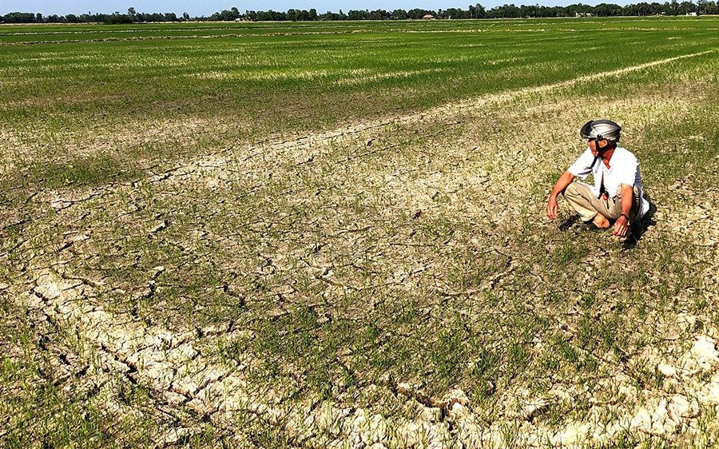

<!-- https://www.youtube.com/watch?v=v048ru5v0BE -->
<!-- remotes::install_github("gadenbuie/cleanrmd") -->

#
#
<link rel="stylesheet" href="style.css" type="text/css">

<!-- ## **Sea level rise, land subsidence and saltwater intrusion project** -->

Pictures showing fields affected by saltwater intrusion 
in the [Mekong Delta, Vietnam](https://baotainguyenmoitruong.vn/ngap-man-o-dong-bang-song-cuu-long-ptag.html) & [North Carolina, U.S.](https://www.climatehubs.usda.gov/hubs/southeast/topic/saltwater-intrusion-and-salinization-coastal-forests-and-farms)

<!-- https://bookdown.org/yihui/rmarkdown/basics-examples.html -->
<!-- https://github.com/emitanaka/icon : insert icons to Rmarkdown-->

 <!-- add black line -->

### **Objectives of the project**
The project has two main objectives: 1. evaluate how and to what extent saltwater intrusion affects agricultural production in the Mekong Delta under uncertainty, and 2) analyze to what extent the expected reduction in rice production in the Mekong Delta affects price for rice and trade internationally. 

### **Publications** 
1). **Tran, D.Q**., Le, N. K., Durand-Morat, A., Nguyen, N.T. N., Bairagi, S., Huynh, V.T. M & Tran, V. T. 2025. [Is It Worth It? Land-fallowing and Saltwater Intrusion Control Under Uncertainty](https://authors.elsevier.com/a/1kYnzB8cd44R0). *Science of the Total Environment*. 966 (2025), 1-15.

2). **Tran, D.Q.**, Nguyen, N.T. N., Huynh, V.T. M., Bairagi, S., Le, N. K., Tran, V. T & Durand-Morat, A. 2023. [Modeling Saltwater Intrusion Risk in the Presence of Uncertainty](https://doi.org/10.1016/j.scitotenv.2023.168140). *Science of the Total Environment*. 908, 168140. [Preprint version can be accessed here](https://papers.ssrn.com/sol3/papers.cfm?abstract_id=4510877). 

